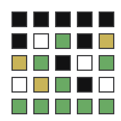

<p align="center">
  
</p>

# Wordget

A vibe-coded, offline-first Wordle clone with infinite daily puzzles.

- Live: https://wordget.app
- Demo Video: https://youtu.be/cQOdyUETQc4

Wordget is built with TypeScript and Bun, served as a static PWA, and designed to work entirely offline once loaded. It was built almost entirely with the Qwen-3-Coder-480B model via Cerebras using Cline to drive incremental edit tasks, with manual checkpoints after each task.

---

## Features

- Offline-first PWA (installable, works without a network after first load)
- Infinite daily puzzles
  - Deterministic word selection seeded by (date × gameCount) so each day has a sequence of puzzles
- On-screen and physical keyboard input
- Standard color feedback (green/yellow/gray) and shareable emoji grid
- A stricter guess validator (must include revealed letters and any known correct positions)
- Stats and streaks saved locally (no backend, no tracking)
- Lightweight stack: TypeScript + Bun, zero runtime dependencies
- Simple static build suitable for Netlify or any static host

---

## Quick Start

Prerequisites:
- Bun (https://bun.sh) installed

Install (optional in this repo, but safe to run):
```
bun install
```

Run locally (dev server at http://localhost:3000):
```
bun run dev
```

Run tests:
```
bun run test
```

Build static files to `dist/`:
```
bun run build
```

You can then serve `dist/` with any static server (e.g., Netlify, Vercel, `python3 -m http.server`, `npx serve`, etc.).

---

## How it Works

- Main logic: `src/index.ts`
  - Words come from `src/words.ts` (standard Wordle lists: `VALID_ANSWER_WORDS` and `OTHER_VALID_GUESS_WORDS`).
  - The target word is chosen deterministically using a simple seeded RNG:
    - seed = YYYYMMDD × gameCount
    - `gameCount` increments as you complete rounds that day (persisted in localStorage), enabling multiple puzzles per day.
- UI and assets:
  - Markup: `src/index.html`
  - Styles: `src/style.css`
  - Icon/PWA: `icon.svg`, `src/manifest.json`
- Service worker: `sw.js`
  - Caches core assets for offline play
  - Receives a version string (Git SHA) at registration time and uses that to version caches
- Dev server: `server.ts` (Bun)
  - Injects the current Git SHA into the HTML (for SW cache-busting in dev)
  - Serves compiled JS from `dist/index.js` during development

---

## Gameplay Notes

- Standard Wordle rules (5-letter words, 6 guesses).
- Color feedback:
  - Green = correct letter in correct position
  - Yellow = letter exists elsewhere in the word
  - Gray = letter not in the word
- Stricter validator: guesses must include all revealed letters and respect known correct positions.
- Share:
  - Winning shows a Share button
  - Uses Web Share API when available; falls back to copying the emoji grid and link to clipboard

---

## Scripts

Defined in `package.json`:

- `bun run dev`
  - Starts the Bun dev server on port 3000
  - Injects the current Git SHA into the HTML at request time
- `bun run test`
  - Runs the test suite (`src/index.test.ts`) via Bun test runner
- `bun run build`
  - Compiles `src/index.ts` to `dist/index.js`
  - Copies `src/index.html`, `src/style.css`, `src/manifest.json`, `sw.js`, and `icon.svg` to `dist/`
  - Replaces `REPLACE_WITH_GIT_SHA` in `dist/index.html` with the `COMMIT_REF` environment variable (used for cache-busting on deploys)

Tip: When building locally, you can set `COMMIT_REF` yourself if you want deterministic cache-busting:
```
COMMIT_REF=$(git rev-parse HEAD) bun run build
```

---

## Project Structure

```
.
├─ src/
│  ├─ index.html        # App shell (loads index.js, registers SW, injects GIT_SHA)
│  ├─ index.ts          # Main game logic (WordgetGame)
│  ├─ style.css         # Styles
│  ├─ words.ts          # Word lists (answers + valid guesses)
│  └─ manifest.json     # PWA manifest
├─ sw.js                # Service worker (offline cache)
├─ server.ts            # Bun dev server (injects GIT SHA; serves assets)
├─ icon.svg             # App icon / social image
├─ package.json         # Scripts and dev deps
├─ tsconfig.json        # TypeScript config
└─ README.md
```

---

## PWA, Caching, and Cache-Busting

- The service worker caches a small set of core assets to enable offline play:
  - `/`, `/style.css`, `/manifest.json`, `/index.js`, `/icon.svg`
- On the client, `src/index.html` sets `window.GIT_SHA = 'REPLACE_WITH_GIT_SHA'`.
  - In development, `server.ts` replaces this with the current Git SHA at request time.
  - In production builds, the `build` script replaces occurrences with the `COMMIT_REF` environment variable (on Netlify this is provided automatically).
- The SW is registered with a cache-busting query string: `/sw.js?cachebust=${GIT_SHA}` and also receives the version via `postMessage`. The SW uses this version to name the cache.

If you need to invalidate caches manually:
- Bump the version (ensure a new Git SHA is injected).
- Or clear site data in your browser:
  - Application tab → Clear storage (Chrome)
  - Or unregister the service worker and hard-reload

Known quirk: after certain updates, you may need a hard reload to ensure the latest SW and assets are active, depending on your browser’s SW lifecycle.

---

## Data Persistence and Privacy

- localStorage keys:
  - `wordget-state` – current session state
  - `wordget-stats` – win count, streak count, last played date, last game won
  - `wordget-last-completed-round` – tracks how many puzzles you've finished today (to seed the next one)
- No backend, no analytics, no trackers. Everything runs client-side.

---

## Deployment (Netlify)

This project is already configured to deploy to Netlify on pushes to `main`.

- Build command: `bun run build`
- Publish directory: `dist/`
- Environment:
  - `COMMIT_REF` is provided by Netlify automatically and is used to stamp the HTML with a unique build/version string for cache-busting. If not present in your environment, set it manually.

Any static host also works—just host the `dist/` directory.

---

## Troubleshooting

- Not seeing updates?
  - Hard refresh the page (Cmd+Shift+R on macOS, Ctrl+Shift+R on Windows/Linux)
  - Unregister the service worker (DevTools → Application → Service Workers)
  - Clear site data (DevTools → Application → Clear storage)
- SW versioning
  - Ensure `window.GIT_SHA` was correctly replaced in HTML (dev server injects it, build replaces it)
- Local build version
  - Optionally set `COMMIT_REF` when running `bun run build` locally to force a new cache version

---

## Tech Stack

- TypeScript + Bun
- Static PWA with Service Worker + Manifest
- No frameworks, minimal dependencies
- Tests via Bun test runner

---

## Acknowledgements

- Inspired by the original Wordle
- Word lists adapted from standard Wordle sources (`src/words.ts`)
- Built using Qwen-3-Coder-480B via Cerebras with Cline orchestrating incremental tasks
- Hosted on Netlify

---

## License

MIT
